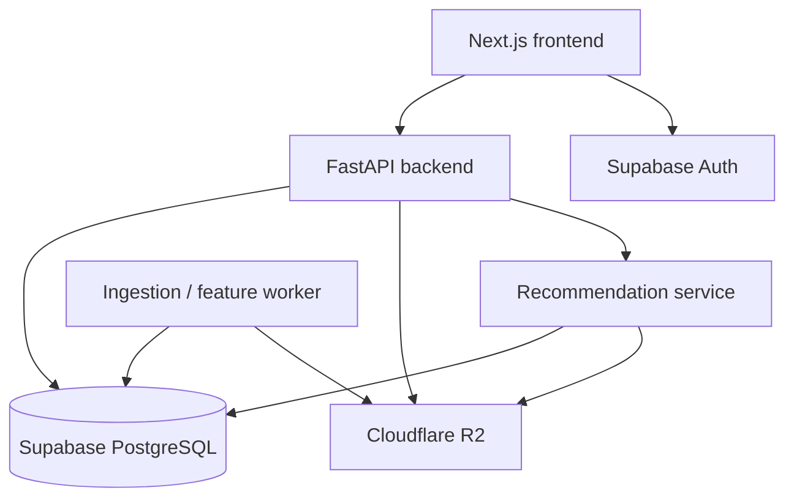
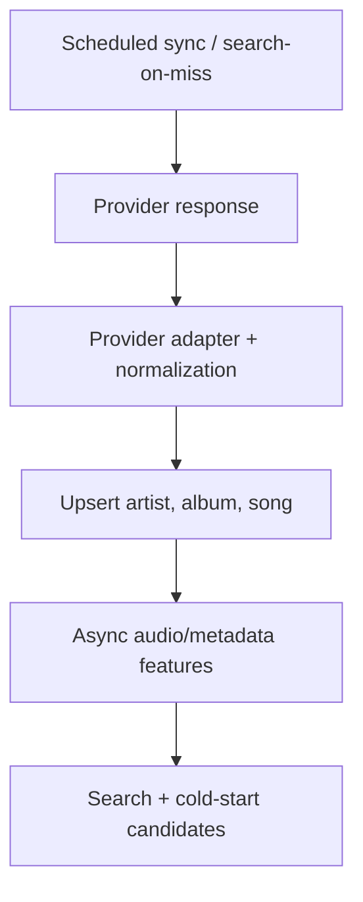

# Music Recommendation Web — Project Handoff

> Cập nhật gần nhất: 2026-09-21  
> Trạng thái: đã chốt hướng kiến trúc và tạo Supabase; chưa triển khai toàn bộ schema/MVP.

## Cách dùng file này khi đổi tài khoản

1. Lưu file này trong repository tại `docs/PROJECT_HANDOFF.md` và cập nhật sau mỗi quyết định lớn.
2. Khi chuyển sang tài khoản ChatGPT khác, tải file lên rồi gửi prompt sau:

```text
Đây là tài liệu bàn giao dự án của tôi. Hãy đọc toàn bộ trước khi trả lời.
Trước tiên, hãy tóm tắt lại: mục tiêu, trạng thái hiện tại, các quyết định đã chốt,
việc cần làm tiếp theo và các rủi ro. Không tự ý thay đổi kiến trúc đã chốt;
nếu đề xuất thay đổi, hãy nêu rõ lợi ích, chi phí và ảnh hưởng trước.
Sau đó hãy tiếp tục hỗ trợ tôi từ mục "Việc cần làm ngay tiếp theo".
```

3. Không bao giờ ghi password, secret key, token hoặc connection string thật vào file này hay GitHub.

---

## 1. Tóm tắt dự án

Xây dựng một website nghe nhạc có thể:

- Đăng ký, đăng nhập và quản lý hồ sơ người dùng.
- Tìm kiếm, chọn và phát bài hát.
- Quản lý hàng đợi, yêu thích và playlist.
- Ghi nhận hành vi nghe: play, pause, seek, skip, nghe hết, like và chọn bài.
- Tự động đề xuất bài tiếp theo trong lúc nghe.
- Hiểu cả gu dài hạn lẫn mong muốn tức thời của phiên nghe.
- Đưa bài mới phát hành vào hệ thống nhanh, kể cả khi chưa có tương tác.
- Không sử dụng LLM làm mô hình gợi ý.
- Có thể triển khai cloud và mở rộng từng giai đoạn.

### Nguyên tắc sản phẩm quan trọng

Nếu người dùng chủ động tìm/chọn một bài hoặc nghệ sĩ đang nổi, hành vi đó thể hiện ý định hiện tại và phải có trọng số cao hơn gu lịch sử. Ví dụ: người thường nghe ballad nhưng vừa tìm bài mới của Taylor Swift hoặc Sơn Tùng thì hệ thống nên tiếp tục theo ngữ cảnh đó, không cố kéo họ về gu cũ ngay lập tức.

---

## 2. Phạm vi MVP

MVP cần chạy end-to-end trước khi làm mô hình phức tạp.

### Có trong MVP

- Frontend nghe nhạc cơ bản.
- Backend API.
- Supabase Auth và PostgreSQL.
- Danh mục bài hát, nghệ sĩ, album.
- Search bài hát/nghệ sĩ.
- Player, queue, like và playlist.
- Ghi listening events chính xác và chống ghi trùng.
- Gợi ý baseline bằng popularity + metadata/content + ngữ cảnh phiên.
- Một luồng ingest/upsert dữ liệu từ ít nhất một nguồn hợp pháp.
- Deploy bản demo cloud.

### Chưa cần trong MVP

- SASRec/BERT4Rec hoặc mô hình deep learning lớn.
- Reinforcement learning/bandit hoàn chỉnh.
- Streaming quy mô thương mại.
- Lưu toàn bộ 30.000 file audio nếu chưa có quyền sử dụng.
- Microservices phức tạp hoặc Kubernetes.

### Definition of Done cho MVP

Một người dùng mới có thể đăng nhập, tìm bài, nghe bài, like/skip, nhận bài đề xuất tiếp theo; các sự kiện được lưu trong database; ứng dụng chạy trên cloud; không lộ secret; có log lỗi và dữ liệu đủ sạch để bắt đầu huấn luyện baseline.

---

## 3. Kiến trúc đã chốt



### Vai trò từng thành phần

| Thành phần | Vai trò |
|---|---|
| Next.js | UI, search, player, queue, tương tác người dùng |
| FastAPI | Business logic, event API, catalog API, recommendation API |
| Supabase Auth | Xác thực người dùng |
| Supabase PostgreSQL | Metadata, quan hệ, interaction events, feature có cấu trúc, model registry |
| Cloudflare R2 | Audio/preview được phép dùng, cover nếu cần, feature file lớn, model artifact |
| Worker | Đồng bộ catalog, trích xuất audio feature, batch training và batch scoring |

### Quy tắc database

- Code truy vấn/repository async nằm trong `backend/app/db/`.
- Schema SQL nằm trong `supabase/migrations/` và được commit GitHub.
- Không chạy `CREATE TABLE` tự động khi FastAPI khởi động ở production.
- Async giúp server phục vụ request khác khi đang chờ I/O; nó không làm một câu SQL đơn lẻ chạy nhanh hơn.
- Các tác vụ CPU/GPU như xử lý audio và training chạy ở worker, không chạy trong request web.
- PostgREST `async with connection()` không mặc nhiên tạo transaction SQL; thao tác nguyên tử nhiều bảng cần PostgreSQL function/RPC hoặc direct transaction.

### Cấu trúc repository dự kiến

```text
music-recommendation/
├── frontend/
│   ├── src/
│   └── .env.local              # không commit
├── backend/
│   ├── app/
│   │   ├── api/
│   │   ├── core/
│   │   ├── db/
│   │   ├── repositories/
│   │   ├── services/
│   │   └── main.py
│   ├── workers/
│   └── .env                    # không commit
├── recommender/
│   ├── training/
│   ├── evaluation/
│   └── serving/
├── supabase/
│   ├── migrations/
│   └── seed.sql
├── docs/
│   └── PROJECT_HANDOFF.md
├── .env.example
├── .gitignore
└── README.md
```

---

## 4. Chiến lược gợi ý không dùng LLM

### Giai đoạn 1 — Baseline cho MVP

Tạo candidate từ nhiều nguồn rồi rerank:

1. Popular/trending và bài mới.
2. Cùng nghệ sĩ, album, genre hoặc đặc trưng audio gần nhau.
3. Liên quan đến 3–5 bài/hành vi gần nhất trong phiên.
4. Loại bài đã nghe quá nhiều, bài bị dislike hoặc vừa skip sớm.

Điểm minh họa:

```text
score = w_long_term * long_term_preference
      + w_session   * short_term_intent
      + w_content   * audio_metadata_similarity
      + w_trending  * freshness_popularity
      + w_transition* bpm_key_energy_compatibility
      - w_skip      * negative_feedback
```

Các trọng số ban đầu là heuristic và cần log lại để đánh giá. Khi người dùng chủ động search/chọn bài, tăng `w_session` tạm thời.

### Giai đoạn 2 — Hybrid collaborative filtering

Mô hình khởi đầu phù hợp: **LightFM với WARP**, kết hợp interaction và item/user features.

- Học gu dài hạn từ lịch sử tương tác.
- Metadata/audio feature hỗ trợ item cold start.
- Dễ huấn luyện, giải thích và làm baseline cho đồ án hơn deep model.
- Retrain định kỳ khi website đã có đủ interaction.

So sánh trong báo cáo:

- Popularity baseline.
- Item-kNN.
- BPR.
- LightFM-WARP chỉ dùng interaction.
- LightFM-Hybrid dùng interaction + content feature.

### Giai đoạn 3 — Session-aware và reranking

- Trước tiên dùng session heuristic hoặc transition graph.
- Khi đủ dữ liệu tuần tự mới thử SASRec/BERT4Rec/SR-GNN.
- Rerank theo BPM, key/Camelot, energy để chuyển bài mượt.
- Mô hình hóa skip: skip dưới 10 giây là tín hiệu âm mạnh; nghe hơn nửa nhưng skip là tín hiệu yếu; nghe hết/like là tín hiệu dương.

### Bốn điểm nhấn nghiên cứu

1. Long-term preference + short-term session intent.
2. Multimodal/audio content cho cold-start.
3. Playlist continuation và smooth transition.
4. Skip penalty/negative feedback.

Không làm cả bốn ở mức sâu ngay từ đầu. Thứ tự ưu tiên: hệ thống chạy được → baseline đo được → hybrid/cold-start → session/transition → skip-aware nâng cao.

---

## 5. Dữ liệu huấn luyện và đánh giá

Không nên trộn lẫn vai trò của ba nhóm dữ liệu:

| Nhóm | Mục đích |
|---|---|
| Public benchmark | Huấn luyện/đánh giá offline có thể tái lập trong báo cáo |
| Catalog từ API | Metadata, search, playback hợp pháp, content feature và demo cold-start |
| Interaction từ website | Huấn luyện production và đánh giá online/pilot |

### Dataset đề xuất

- **Taste Profile Subset / Million Song Dataset**: bắt đầu với LightFM và bài toán long-term preference.
- **Music Streaming Sessions Dataset (MSSD)**: cân nhắc ở giai đoạn session/skip vì rất lớn.

Mô hình collaborative filtering huấn luyện bằng ID trong benchmark không thể tự động gợi ý các ID bài hát đã crawl nếu hai catalog không được ánh xạ. Có thể chuyển kiến trúc/hyperparameter, nhưng production model phải được train lại bằng interaction của chính nền tảng. Content/audio embedding có khả năng chuyển giao tốt hơn.

### Chia dữ liệu

- Split theo thời gian, không random tùy tiện gây data leakage.
- Mỗi user: quá khứ dùng train, tương tác sau dùng validation/test.
- Có một **cold-item split** riêng: item trong test không có interaction trong train, chỉ có metadata/audio feature.
- Không dùng dữ liệu test để chọn hyperparameter.

### Metric offline

- Metric chính: `NDCG@10`.
- Metric phụ: `Recall@10`, `MRR@10`, `Precision@10`, catalog coverage.
- Có thể báo cáo thêm tại `K = 5, 10, 20`.
- Báo riêng kết quả normal split và cold-item split.

### Metric online/pilot

- Recommendation click/play-through rate.
- Skip rate trong 10/30 giây đầu.
- Completion rate.
- Listening time/session length.
- Like/save rate.
- New-song discovery rate.

Không so trực tiếp metric online với metric offline như thể chúng là cùng một thí nghiệm.

### Thống kê phải có trong báo cáo

- Số user, song, interaction.
- Sparsity.
- Mean/median interaction mỗi user và mỗi item.
- Kích thước train/validation/test.
- Tỷ lệ missing metadata/audio feature.
- Tỷ lệ catalog có thể phát hợp pháp.
- Thời gian training/inference và dung lượng model.

---

## 6. Catalog và bài hát mới

### Luồng ingest



- Dùng scheduled catalog sync cho nghệ sĩ/nguồn quan trọng.
- Khi người dùng search không thấy, có thể search-on-miss qua provider rồi ingest kết quả.
- Mỗi provider cần adapter riêng: raw JSON → schema nội bộ.
- Dùng `unique(source_provider, external_id)` để upsert và tránh trùng.
- Lưu `raw_metadata jsonb` để debug và tái xử lý.
- Bài mới chưa có interaction được candidate bằng artist/genre/audio similarity, freshness và popularity từ provider.
- Bài mới của nghệ sĩ nổi tiếng có thể vào khu vực trending/new releases, nhưng vẫn cần diversity và giới hạn spam.

### Lưu ý pháp lý

API metadata không đồng nghĩa với quyền tải, lưu hoặc stream audio. Chỉ phát preview/provider URL hoặc file có giấy phép/quyền sử dụng. Trong báo cáo và demo phải ghi rõ nguồn và phạm vi giấy phép.

---

## 7. Schema database dự kiến

### Bảng MVP

| Bảng | Mục đích |
|---|---|
| `profiles` | Hồ sơ mở rộng của `auth.users` |
| `artists` | Nghệ sĩ và provider identity |
| `albums` | Album/single/EP |
| `songs` | Catalog bài hát đã chuẩn hóa |
| `song_artists` | Quan hệ nhiều-nhiều, role và thứ tự nghệ sĩ |
| `genres` | Danh mục genre |
| `song_genres` | Quan hệ song–genre |
| `playlists` | Playlist thuộc user |
| `playlist_songs` | Các bài và vị trí trong playlist |
| `user_likes` | Like/save của user |
| `listening_sessions` | Phiên nghe |
| `listening_events` | Play/pause/seek/skip/complete/like/search/select |

### `songs` đề xuất

```text
id                      uuid PK
source_provider         text not null
external_id             text not null
external_url            text nullable
isrc                    text nullable
album_id                uuid nullable -> albums.id
title                   text not null
duration_ms             integer nullable
track_number            integer nullable
release_date            date nullable
explicit                boolean nullable
cover_url               text nullable
source_audio_url        text nullable
preview_url             text nullable
audio_object_key        text nullable
license_name            text nullable
license_url             text nullable
can_stream              boolean not null default false
can_download            boolean not null default false
status                  text not null
provider_popularity     numeric nullable
popularity_score        numeric nullable
raw_metadata            jsonb
last_synced_at          timestamptz nullable
created_at              timestamptz
updated_at              timestamptz
UNIQUE(source_provider, external_id)
```

`provider_popularity` giữ giá trị gốc; `popularity_score` là giá trị nội bộ đã chuẩn hóa vì mỗi provider dùng thang đo khác nhau. `audio_object_key` chỉ lưu object key nội bộ, không lưu signed URL hết hạn.

### Bảng bổ sung sau MVP

- `song_audio_features`: tempo, key, mode, energy, danceability, valence, embedding, extractor/version.
- `ingestion_jobs`: trạng thái đồng bộ/trích xuất.
- `recommendation_runs` và `recommendation_items`: audit/đánh giá recommendation.
- `model_versions`: tên, version, dataset, metrics, artifact key, trạng thái deploy.
- Aggregate tables/materialized views cho trending và thống kê ngày.

### Event quan trọng

`listening_events` cần ít nhất:

- `id`, `client_event_id` unique để chống gửi trùng.
- `user_id`, `session_id`, `song_id`.
- `event_type`.
- `position_ms`, `listened_ms`, `duration_ms`.
- `source` như search/recommendation/playlist/direct.
- `recommendation_run_id` nếu bài đến từ gợi ý.
- `occurred_at`, `received_at`.
- `metadata jsonb` có kiểm soát.

---

## 8. Supabase, R2 và secrets

### Trạng thái hiện tại

- Đã tạo project Supabase.
- Đã tạo hai file môi trường cho frontend/backend theo trao đổi.
- Chưa nên ghi bất kỳ giá trị secret thật nào vào tài liệu này.

### Biến môi trường dự kiến

Frontend `.env.local`:

```text
NEXT_PUBLIC_SUPABASE_URL=
NEXT_PUBLIC_SUPABASE_PUBLISHABLE_KEY=
```

Backend `.env`:

```text
SUPABASE_URL=
SUPABASE_PUBLISHABLE_KEY=
SUPABASE_SECRET_KEY=          # chỉ worker/backend tin cậy khi thực sự cần
DATABASE_URL=                 # chỉ khi kết nối PostgreSQL trực tiếp
R2_ENDPOINT_URL=
R2_ACCESS_KEY_ID=
R2_SECRET_ACCESS_KEY=
R2_BUCKET_NAME=
```

- Project ID/reference không phải secret key.
- Trong connection string, thay toàn bộ `[YOUR-PASSWORD]`, kể cả dấu ngoặc vuông; URL-encode ký tự đặc biệt.
- Không cần `DATABASE_URL` nếu chỉ dùng Supabase SDK/Data API.
- Commit `.env.example`, không commit `.env` hoặc `.env.local`.

### Cấu hình Supabase đã khuyến nghị

- Data API: bật.
- Automatically expose new tables: tắt để chủ động quyền truy cập.
- Automatic RLS: bật.
- Region gần người dùng, ví dụ Singapore cho người dùng Việt Nam.
- GitHub integration: có thể để trống lúc đầu; quản lý migration bằng Supabase CLI và GitHub trước.

### Chính sách truy cập

- Client chỉ dùng publishable key và chịu RLS.
- User chỉ sửa profile/playlist/like thuộc chính họ.
- Event ingestion ưu tiên qua backend để validate và chống gian lận/trùng.
- Bảng model, ingestion và admin chỉ backend/worker truy cập.
- Secret/service credential không bao giờ đi xuống browser.

### Storage

- PostgreSQL không lưu binary audio.
- R2 lưu audio/preview hợp pháp, cover cần kiểm soát, feature file lớn và model artifact.
- Không dùng Google Drive làm production streaming backend.
- Không nhất thiết lưu toàn bộ raw audio: có thể xử lý tạm để trích feature rồi xóa nếu license/quy trình cho phép.
- Model artifact nên lưu private trên R2; `model_versions` trong Supabase lưu object key, metric và metadata. Backend tải model khi khởi động/deploy và cache, không tải lại mỗi request.

---

## 9. Lộ trình triển khai

### Phase 0 — Nền móng

- [x] Chốt mục tiêu tổng thể.
- [x] Tạo Supabase project.
- [x] Tạo env frontend/backend.
- [ ] Tạo GitHub repository và `.gitignore`.
- [ ] Khởi tạo Next.js, FastAPI và Supabase CLI.
- [ ] Viết migration đầu tiên + RLS.
- [ ] Thiết lập CI tối thiểu: lint/test/build.

### Phase 1 — Web MVP end-to-end

- [ ] Auth và profile.
- [ ] Catalog API/UI.
- [ ] Search.
- [ ] Player và queue.
- [ ] Like và playlist.
- [ ] Event tracking idempotent.
- [ ] Recommendation baseline.
- [ ] Deploy frontend/backend.
- [ ] Smoke test toàn bộ user journey.

### Phase 2 — Data ingestion và cold-start

- [ ] Chọn provider/dataset hợp pháp.
- [ ] Provider adapter + normalized upsert.
- [ ] Scheduled sync và search-on-miss.
- [ ] Audio/metadata feature pipeline.
- [ ] New-release/trending/content candidates.
- [ ] Đánh giá cold-item split.

### Phase 3 — Offline recommender experiment

- [ ] Chuẩn bị Taste Profile dataset.
- [ ] Temporal split và negative sampling nhất quán.
- [ ] Popularity, Item-kNN, BPR baselines.
- [ ] LightFM-WARP và LightFM-Hybrid.
- [ ] Reproducible experiment config/seed.
- [ ] Báo cáo NDCG/Recall/MRR/Precision/Coverage.
- [ ] Model registry + R2 artifact.

### Phase 4 — Session, transition và skip

- [ ] Session candidate/reranker.
- [ ] Transition graph.
- [ ] BPM/key/energy reranking.
- [ ] Skip-aware labels/loss.
- [ ] Chỉ thử SASRec/BERT4Rec/SR-GNN khi dữ liệu đủ.

### Phase 5 — Pilot và cải tiến

- [ ] Dashboard quality/data health.
- [ ] Online metrics.
- [ ] A/B hoặc interleaving test phù hợp quy mô.
- [ ] Retraining schedule và rollback model.
- [ ] Monitoring latency/error/drift.

---

## 10. Việc cần làm ngay tiếp theo

Không bắt đầu bằng training. Thứ tự đề xuất:

1. Tạo GitHub repository và commit bộ khung an toàn, gồm `.gitignore`, `.env.example` và file bàn giao này.
2. Khởi tạo `frontend`, `backend`, `supabase/migrations`.
3. Thiết kế migration MVP theo nhóm nhỏ: catalog → user data → listening events.
4. Bật RLS ngay trong migration và viết test quyền truy cập.
5. Tạo seed catalog nhỏ khoảng 20–100 bài hợp pháp/preview để phát triển UI.
6. Làm vertical slice đầu tiên: đăng nhập → xem catalog → play → ghi event.
7. Sau đó mới thêm search, like, playlist, queue và recommendation baseline.

Mốc gần nhất nên hoàn thành: **một vertical slice chạy end-to-end**, không phải một mô hình ML hoàn chỉnh.

---

## 11. Rủi ro và cách kiểm soát

| Rủi ro | Cách kiểm soát |
|---|---|
| Phạm vi quá lớn | Chỉ làm một phase tại một thời điểm; dùng Definition of Done |
| Không có quyền audio | Dùng preview/file hợp pháp, ghi rõ license, không crawl trái điều khoản |
| Dữ liệu tương tác quá ít | Public benchmark cho offline; baseline/content cho sản phẩm ban đầu |
| Data leakage | Temporal split, version dataset và pipeline |
| Recommendation không giải thích được | Log candidate source, score component và model version |
| Lộ secret | `.gitignore`, secret manager của cloud, rotate khi nghi ngờ |
| Database chậm | Index theo query thật, pagination, aggregate jobs; không tối ưu mù |
| Worker làm nghẽn API | Tách batch/audio/training khỏi request path |
| Mô hình benchmark không khớp catalog | Mapping rõ ràng hoặc train lại trên interaction của platform |
| Bài mới lấn át gu người dùng | Freshness boost có giới hạn, diversity và session-aware rerank |

---

## 12. Quy tắc cập nhật tài liệu

Sau mỗi buổi làm việc, chỉ cần cập nhật bốn phần:

1. `Trạng thái hiện tại`.
2. Checklist trong `Lộ trình triển khai`.
3. `Việc cần làm ngay tiếp theo`.
4. Decision Log dưới đây.

### Decision Log

| Ngày | Quyết định | Lý do |
|---|---|---|
| 2026-09-21 | Không dùng LLM để gợi ý | Đúng yêu cầu đề tài; dễ đánh giá recommender truyền thống |
| 2026-09-21 | MVP trước, ML nâng cao sau | Giảm rủi ro tích hợp và quá tải phạm vi |
| 2026-09-21 | Supabase cho Auth/PostgreSQL | Cloud managed, phù hợp MVP |
| 2026-09-21 | R2 cho object/model artifact | Không nhét binary vào PostgreSQL |
| 2026-09-21 | Schema qua migration, không create table lúc startup | Tái lập, review và deploy an toàn |
| 2026-09-21 | LightFM-WARP/Hybrid là mô hình đầu tiên | Phù hợp dữ liệu implicit và hỗ trợ item feature |
| 2026-09-21 | Benchmark + catalog API + interaction web có vai trò riêng | Đánh giá khoa học và vận hành production không bị lẫn |

### Nhật ký phiên làm việc — mẫu

```text
Ngày:
Đã hoàn thành:
Quyết định mới:
File/migration đã thay đổi:
Test đã chạy và kết quả:
Blocker/rủi ro:
Ba việc tiếp theo:
```

---

## 13. Checklist bàn giao sang tài khoản/máy khác

- [ ] Repository GitHub chứa source, migration, README và file này.
- [ ] Không có secret trong Git history.
- [ ] Có `.env.example` chỉ chứa tên biến.
- [ ] Ghi rõ runtime version và lệnh chạy trong README.
- [ ] Ghi rõ migration/seed command.
- [ ] Dataset lớn và model không commit Git; chỉ lưu manifest/checksum/object key.
- [ ] Export hoặc ghi lại dashboard/config cloud cần thiết mà không lộ secret.
- [ ] Lưu link tài liệu chính thức và điều khoản/license của data provider.
- [ ] Tài khoản mới được cấp quyền GitHub/Supabase/R2 riêng; không gửi secret qua chat.
- [ ] Rotate credential nếu credential từng bị dán vào chat, ảnh hoặc commit.

File này là nguồn sự thật về **kế hoạch và quyết định**. GitHub là nguồn sự thật về **code và migrations**. Supabase/R2 là nguồn sự thật về **trạng thái cloud và dữ liệu/artifact**.
